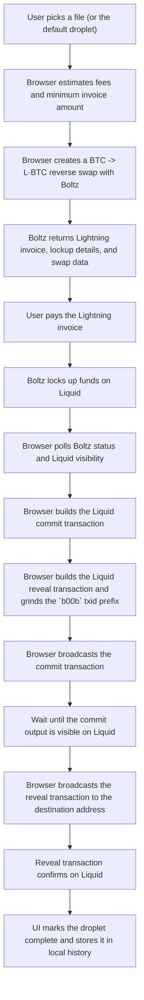

# dropletbox.com

**Droplet Box: liquidate your memories &trade;!**

Need a cheap, durable place to store all those priceless family photos and feet pics? Then the Liquid blockchain may be the storage solution you never knew you needed!

Why settle for boring old cloud storage when you can preserve your precious files on a blockchain built to last? With pricing so competitive, it might even make AWS S3 nervous!*

Droplet Box&trade; because your memories deserve to be publicly viewable, forever and ever and ever.

\*Liquid Network storage projected to beat AWS S3 prices after just 150,000 years of continuous storage.

## Warning

This is beta software. Do not use it.

Do not trust it with real funds, important files, private data, or anything you care about. Content written this way is intentionally public and effectively permanent, and also the swap / broadcast flow may not work.

## Is it a metaprotocol?

errrrr i dont think so, its just for fun, and to show how you can also store data on liquid, relatively cheaply. But i am not the metaprotocol police.

## What It Does

Dropletbox is a browser app that:

- takes a file payload (400k vbytes max),
- creates a Boltz BTC -> L-BTC reverse swap invoice,
- waits for the Boltz lockup transaction on Liquid,
- builds a commit transaction and a reveal transaction in the browser,
- broadcasts both to Liquid,
- and lets you inspect droplets again by reveal txid.

The reveal transaction is ground so its displayed txid starts with `b00b`.

## Transaction Flow

